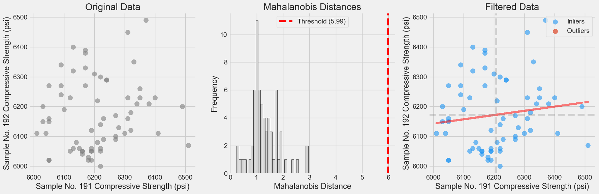

# 🎯 Mahalanobis Outlier Detective

Elegantly identify outliers in your paired sample data using the sophisticated Mahalanobis distance metric. Perfect for quality control, experimental validation, and catching those sneaky data points that just don't belong.

## ✨ Features

- **Robust Outlier Detection**: Implements Mahalanobis distance for multivariate outlier detection
- **Beautiful Visualizations**: Creates three insightful plots to understand your data:
  - Original data scatter plot
  - Distance histogram with critical threshold
  - Filtered results with regression line and reference means
- **Flexible Processing**: Handles paired samples with missing values gracefully
- **Statistical Rigor**: Uses chi-square distribution for proper statistical significance testing

## 🚀 Quick Start

```python
from mahalanobis_filter import MahalanobisFilter

# Load your paired sample data
data = pd.read_csv('your_data.csv')
processed_data = process_data(data)

# Initialize and run the filter
filter_obj = MahalanobisFilter(alpha=0.05)
filter_obj.fit(processed_data)
inliers, outliers = filter_obj.filter(processed_data)

# Visualize the results
create_plots(processed_data, inliers, outliers)
```

## 📊 Example Output

The visualization suite produces three plots:


1. **Original Data**: Raw scatter plot of your paired samples
2. **Distance Analysis**: Histogram of Mahalanobis distances with critical threshold
3. **Filtered Results**: Inliers (blue) and outliers (red) with regression line and mean references

## 🔧 Parameters

- `alpha`: Significance level for outlier detection (default: 0.05)
- Input data should have columns: "Sample 1" and "Sample 2"

## 📈 Use Cases

- Quality control in manufacturing
- Experimental data validation
- Paired sample analysis
- Statistical process control

## 🤓 Math Behind the Magic

The Mahalanobis distance is calculated as:
```
d = √[(x - μ)ᵀ Σ⁻¹ (x - μ)]
```
where:
- x is the data point
- μ is the mean vector
- Σ⁻¹ is the inverse covariance matrix

## 📝 Requirements

- numpy
- pandas
- matplotlib
- scipy


